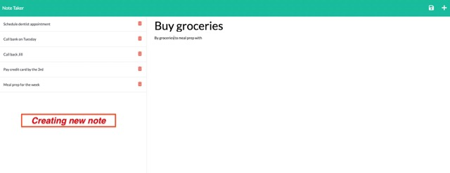

# Note-Taker

## Description
The Note Taker application uses a Express.js back end that saves, deletes, and retrives note data from a JSON file. The back end uses GET, POST and DELETE html/api routes that connect to the front end, allowing users to create, save, and delete notes.

## Table of Contents

- [Installation](#installation)
- [Usage](#usage)
- [License](#license)
- [Credits](#credits)
- [Refrences](#refrences)

## Installation
User will clone the repository. After cloning, run "npm install" to install the necessary packages. This application requires node, express, and uuid.

## Usage
To run the app type "node server.js" or "npm start" into the command-line. User will then be given localhost link where they can use the application.

## License
This application is licensed under MIT.

For detailed information about this license, go to https://mit-license.org/.

## Credits
This project was completed through the University of Minesota Coding Bootcamp

## Refrences
* [express()](https://expressjs.com/en/4x/api.html#express)
* [express.router](https://expressjs.com/en/guide/routing.html)
* [uuid](https://www.npmjs.com/package/uuid)
* [Reading Files With Node.js](https://nodejs.dev/en/learn/reading-files-with-nodejs/)